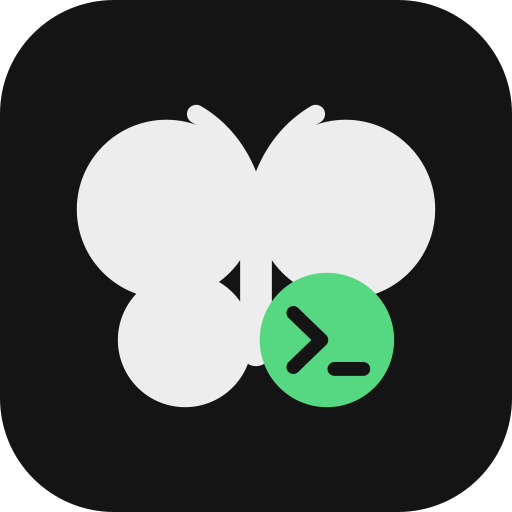

<p align="center">
  
</p>

<h1 align="center">butterfly code</h1>

<p align="center">
  A terminal coding agent with a token-efficient harness.<br>
  High task accuracy on mid-tier and local models, and long-running work you can leave alone.
</p>

<p align="center">
  <a href="https://www.npmjs.com/package/butterfly-code"></a>
  <a href="LICENSE"></a>
</p>

---

Most of an agent's accuracy and cost is decided by the harness around the
model: what goes into the context window, which tools exist, how edits are
applied and when work stops. Butterfly Code is built around that harness, so
it gets good results from affordable models and keeps working through long
tasks.

## Install

```sh
npm install -g butterfly-code      # or: bun add -g butterfly-code / pnpm add -g butterfly-code
```

Other options:

```sh
# macOS / Linux, prebuilt binary
curl -fsSL https://raw.githubusercontent.com/Deveshu04/Butterfly-Code-CLI/master/scripts/install.sh | sh

# Windows (PowerShell), prebuilt binary
irm https://raw.githubusercontent.com/Deveshu04/Butterfly-Code-CLI/master/scripts/install.ps1 | iex

# Homebrew
brew install Deveshu04/tap/butterfly-code

# Scoop
scoop bucket add butterfly https://github.com/Deveshu04/scoop-bucket
scoop install butterfly-code
```

Binaries for Linux, macOS and Windows are also attached to every
[GitHub release](https://github.com/Deveshu04/Butterfly-Code-CLI/releases).
No runtime is needed; the binary is self-contained.

## Quick start

```sh
cd your-project
butterfly
```

The first launch walks you through `/setup`: pick a provider, paste an API key
(or choose a local server such as Ollama or LM Studio) and pick a model. Then
describe a task. Type `/` to see every command.

Run a task without the UI:

```sh
butterfly run "add a --version flag" --model openrouter/qwen/qwen3-coder
```

It exits `0` when done, `124` when a budget was reached and `1` on error;
`--json` prints a machine-readable result.

## What's different

- **Cache-shaped context.** A frozen system prefix and an append-only
  transcript keep provider prompt caches warm. Old tool output is pruned
  before anything is summarized.
- **Reliable edits.** Search/replace edits keep line endings, tolerate
  indentation drift, show the closest match on a miss, and TypeScript or
  JavaScript edits that would not parse are rejected before they touch disk.
- **A small tool set.** Twelve tools, with related capabilities behind an `op`
  parameter, because accuracy drops as tool lists grow.
- **Code graph.** Tree-sitter, SQLite and PageRank give the model a ranked map
  of your repository and an `explore` tool for outlines, symbols, callers and
  dependencies, instead of grep-and-read loops.
- **Memory that stays small.** Capped project and user memory, on-demand
  search over past sessions, and skills promoted only after they worked twice.
- **Parallel subagents.** Up to six at once, optionally each in its own git
  worktree, on a cheaper model; watch any of them live.
- **Long-task safety nets.** Automatic continuation when a reply is cut off or
  the plan isn't finished, step-level retries, token and dollar budgets, and
  `/undo` / `/rewind` checkpoints.
- **Autonomous loops.** `butterfly loop` turns a spec into a task queue and
  works through it: each task in a fresh context, your tests as the gate, a
  git commit on green, crash-safe resume.
- **Clear UI.** Replies, thinking, tool actions and shell commands look
  different. Running commands stream live and can be stopped, and the plan,
  agents, shells and costs stay visible in side panels.

## Providers

Use any of these with `provider/model` ids:

| Provider | Example |
|---|---|
| OpenRouter | `openrouter/qwen/qwen3-coder` |
| Anthropic | `anthropic/<model>` |
| Google | `google/<model>` |
| OpenAI | `openai/<model>` |
| NVIDIA NIM | `nvidia/<model>` |
| Sarvam | `sarvam/sarvam-105b` |
| LiteLLM proxy | `litellm/<model_name>` |
| Ollama (local) | `ollama/qwen3:8b` |
| LM Studio (local) | `lmstudio/<model>` |

Any other OpenAI-compatible endpoint works through `providers.<name>.baseURL`.
Context limits and prices come from [models.dev](https://models.dev), so
compaction and dollar budgets work out of the box.

## Configuration

Settings live in `butterfly.jsonc` in your project or in
`~/.config/butterfly/butterfly.jsonc`; the project file wins.

```jsonc
{
  "model": "openrouter/qwen/qwen3-coder",
  "small_model": "openrouter/qwen/qwen3-8b",        // cheap model for summaries and review
  "providers": {
    "openrouter": { "apiKey": "{env:OPENROUTER_API_KEY}" }
  },
  "permissions": {
    "*": "ask",
    "bash": { "git status*": "allow", "git push*": "ask" },
    "edit": { ".env*": "deny" }
  },
  "maxSpendUSD": 2,                                  // per turn
  "gates": [                                         // used by `butterfly loop`
    { "name": "test", "command": "bun test" }
  ]
}
```

Permissions are glob rules per tool with `allow`, `ask` or `deny`; the most
specific rule wins and `deny` always wins. Shell commands that are provably
read-only (`ls`, `git status`, `rg foo | head`) don't ask under a blanket
`ask`. `/permissions` shows the active rules.

## Commands

| Command | What it does |
|---|---|
| `butterfly` | Interactive terminal UI |
| `butterfly run "<task>"` | Run one task headless |
| `butterfly loop plan "<spec>"` / `loop run` / `loop status` | Autonomous task queue |
| `butterfly bench` | Measure solve rate, input tokens per solved task and malformed-edit rate |
| `butterfly doctor` | Check config, context size and setup |
| `butterfly acp` | Agent Client Protocol server over stdio, for editors that support ACP |

Inside the UI, `/help` lists everything. A few highlights: `/model`, `/think`
(reasoning effort), `/plan` (read-only planning mode), `/context`, `/undo`,
`/rewind`, `/resume`, `/review`, `/commit`, `/shells`, `/agents`, `/memory`,
`/skills`.

## Autonomous loops

```sh
butterfly loop plan "Build a REST API for todos with tests"
butterfly loop run --budget 500000
butterfly loop status
```

The supervisor has no model of its own: it claims one ready task, runs it in a
fresh context, runs your gates, commits on green and re-queues with the
failure output on red. Stop it at any time; `loop run` resumes where it left
off.

## Documentation

- [Architecture](docs/architecture.md): how a turn flows through the engine
- [Design decisions](docs/decisions/): what was chosen and why
- [What is written to disk](docs/storage.md)

## From source

Requires [Bun](https://bun.sh) 1.3 or newer.

```sh
git clone https://github.com/Deveshu04/Butterfly-Code-CLI.git
cd Butterfly-Code-CLI
bun install
bun packages/cli/src/index.ts
```

## Contributing

Contributions are welcome. Please read [CONTRIBUTING.md](CONTRIBUTING.md);
commits need a DCO sign-off (`git commit -s`). Report security issues
privately as described in [SECURITY.md](SECURITY.md).

## License

[Apache License 2.0](LICENSE). Release binaries include third-party
components under their own licenses; see
[THIRD_PARTY_NOTICES.md](THIRD_PARTY_NOTICES.md).
