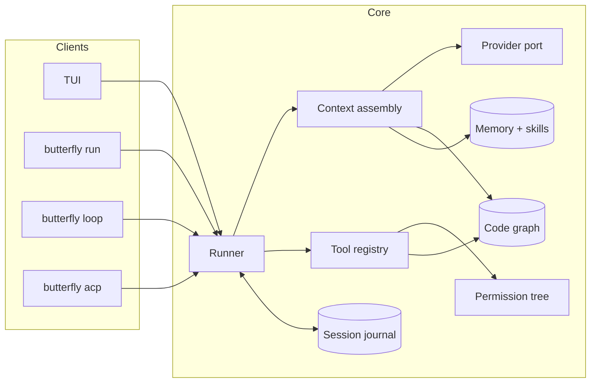
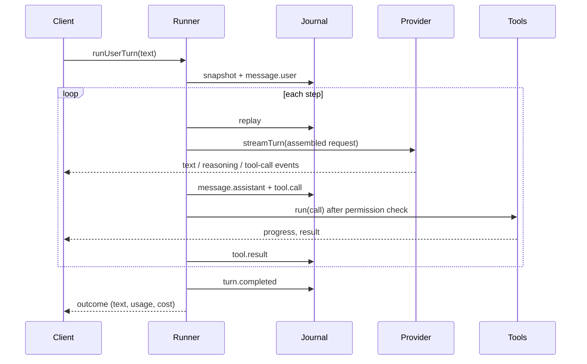

# Architecture

Butterfly Code is a terminal coding agent built around one idea: most of an
agent's accuracy and cost is decided by the **harness** around the model, not
by the model alone. The harness controls what goes into the context window,
which tools exist, how edits are applied, and when work stops. This document
describes how the pieces fit together.

## Packages

```
packages/core   @butterfly/core  the engine; no UI code
packages/tui    @butterfly/tui   full-screen terminal UI (OpenTUI + SolidJS)
packages/cli    @butterfly/cli   the `butterfly` command: TUI, headless run, loop, bench, doctor, acp
```

The core exposes a small surface: `runUserTurn(deps, text)` plus the stores it
reads and writes. Every front end (TUI, headless `run`, `loop`, the ACP server)
is a thin client over that function and the `RunnerEvent` stream it emits.



## Life of a turn

1. **Input.** The client hands the runner the user's text (and any image
   attachments), the model, permission rules, budgets and an event callback.
2. **Snapshot.** Before anything changes, the runner records a git tree
   snapshot of the workspace (a temporary index, no commits), so `/undo` and
   `/rewind` can restore files later.
3. **Journal.** The user message is appended to the session journal.
4. **Step loop.** Each step:
   - replays the journal and **assembles** the request: the frozen system
     prefix, the transcript, and refreshable context (nested `AGENTS.md`,
     code-graph hints);
   - **prunes** old tool output and, near the context limit, **compacts**
     older turns into a structured summary;
   - **streams** the model's reply through the provider port, forwarding text,
     reasoning and tool-call events to the client as they arrive;
   - **journals** the assistant message and its tool calls;
   - runs each tool call through the **registry**: input repair and
     validation, permission decision (allow / ask / deny), hooks, execution,
     output bounding; then journals the result.
5. **Stop or continue.** The loop ends when the model stops calling tools. The
   runner may continue on its own when the reply was cut off at the output
   limit, or when the model stopped while its own todo list still has open
   items (bounded and progress-gated). Token, dollar and step budgets are
   checked between steps.
6. **After the turn.** A background reviewer may update memory and draft
   skills; the code graph re-syncs files the turn changed.



## Context assembly

The request is shaped for provider prompt caching:

- **Immutable prefix.** The system prompt (chosen per model family), memory
  files and the skill index are frozen when the session starts and never
  change mid-session.
- **Append-only transcript.** Messages are only ever added, so each step
  re-uses the cached prefix of the previous one. On Anthropic, explicit cache
  breakpoints are placed on the prefix and on the rolling tail.
- **Refreshable sources.** Inputs that do change (nested `AGENTS.md` files for
  directories the agent touched, code-graph hints) are reconciled as deltas
  instead of rebuilding the prompt.
- **Pruning before compaction.** Tool output older than a recency window is
  replaced with a short placeholder first. Only if that is not enough are older
  turns summarized, with a fixed template (objective, details, work state,
  next move, files), keeping the most recent turns verbatim and carrying the
  todo list forward unchanged.

## Providers

`ProviderPort` is the only interface the core uses to talk to models:
`streamTurn(request) -> AsyncIterable<TurnEvent>`. The single implementation is
an adapter over the Vercel AI SDK (OpenAI-compatible, Anthropic and Google
packages). Presets cover OpenRouter, OpenAI, Anthropic, Google, NVIDIA, Ollama,
LM Studio, Sarvam and LiteLLM; any other OpenAI-compatible endpoint works via
`providers.<name>.baseURL`.

Model limits and pricing come from a cached [models.dev](https://models.dev)
catalog with an offline fallback. The runner always sends an explicit output
cap (the catalog limit, clamped to the remaining window) so a provider's small
default never truncates replies. Failures are classified (rate limit, auth,
quota, context length, network, ...) and transient ones are retried with
backoff at the step level. A stream that ends without a finish event is
treated as a dropped connection and retried.

## Tools

The model sees twelve tools: `bash`, `read`, `edit`, `glob`, `grep`, `todo`,
`explore`, `memory`, `skill`, `task`, `mcp` and `web`. Tool count is kept low
on purpose because accuracy drops as the tool list grows; broad capabilities
are dispatched through an `op` parameter (`explore op=map|outline|symbol|deps`,
`task op=run|merge|discard|list`, `mcp op=list|describe|call`).

Every call goes through the registry:

- **Repair.** Common model mistakes (a misspelled tool name, arguments sent
  as a JSON string, truncated JSON) are repaired before validation.
- **Permissions.** A tree of glob rules per tool decides `allow`, `ask` or
  `deny`, e.g. `{"*": "ask", "bash": {"git *": "allow"}, "edit": {".env*": "deny"}}`.
  Shell pipelines that are provably read-only (a strict allowlist parsed
  without a model) skip a blanket `ask`. Headless runs never ask; an `ask`
  becomes a deny.
- **Hooks.** `pre.tool` hooks can block a call; `post.tool` hooks can feed a
  failing check (lint, type errors) back into the result.
- **Output bounding.** Full output is kept for the UI and journal; the model
  gets a capped head/tail view. Shell output is cleaned of ANSI codes,
  progress bars and repeated lines.

### Edits

The default edit format is search/replace. The engine preserves line endings,
tolerates indentation drift (re-indenting the replacement to match), and on a
miss quotes the closest matching region so the model can correct itself.
TypeScript and JavaScript edits that would produce a syntax error are rejected before touching disk.

### Shells

Foreground commands run in a fresh, non-interactive shell per call (Git Bash on
Windows, `bash` elsewhere), with pagers disabled and stdin closed. Each runs in
its own process group so a stop or timeout kills the whole tree. Output
streams live to the UI. `background: true` starts a detached task whose output
goes to a log file; background tasks are reaped when the session ends.

## Code graph

The graph gives the model orientation without reading whole files:

1. **Parse.** Tree-sitter grammars (WebAssembly) and tag queries extract
   definitions and references for TypeScript, JavaScript, Python, Go, Rust and
   Java.
2. **Store.** Files, symbols and edges go into SQLite with full-text search.
3. **Rank.** Personalized PageRank weights files in the conversation and
   symbols the user mentioned.
4. **Use.** The first turn carries a short module overview and a ranked repo
   map within a token budget; later turns get a few lines about the files and
   symbols they name. The `explore` tool answers map, outline, symbol (body
   plus callers) and dependency queries.

Sync is incremental: content hashes plus a stat fast path, re-run after edits
and after each turn. A readable `.butterfly/project-map.md` (with a Mermaid
module graph) is written only when the code changed.

## Memory and skills

- **Memory files.** `PROJECT.md` and `USER.md` have hard size caps and are
  frozen into the prefix at session start. Edits are small substring deltas;
  an edit that would exceed the cap fails and asks for consolidation instead
  of silently truncating. Agent-written entries are scanned for prompt
  injection.
- **Episodic recall.** SQLite FTS5 over past session journals, queried on
  demand (`memory op=search`); it costs no context until used.
- **Skills.** Reusable procedures with progressive disclosure: a one-line
  index in the prompt, the full body loaded on demand. After a turn that did
  real work, a reviewer on a cheaper model can record facts and draft skills;
  a draft is promoted only after two verified runs.

## Subagents and parallel work

`task` starts a subagent with its own journal and a fresh context and returns
only a short summary. `task tasks=[...]` fans out up to six at a time,
optionally each in its own git worktree, on a cheaper `subagent_model` by
default. The parent reviews the summaries and merges good worktrees back
(`op=merge`) or discards them. Subagent spend counts toward the parent's
budgets.

## Autonomous loops

`butterfly loop` runs long jobs without a human in the loop:

- `loop plan` turns a spec into a dependency graph of tasks in a SQLite queue.
- `loop run` is a supervisor with no model of its own. Each iteration claims
  one ready task, runs it in a fresh context, then runs the configured gates
  (tests, typecheck) one at a time. A green gate creates a git commit; a red
  gate re-queues the task with the failure output; three failures block it.
- Budgets are predictive (an iteration that cannot be afforded never starts),
  and a no-progress detector stops repeated identical work.
- Every decision is written to `loop.jsonl` and `handoff.json`. Resuming after
  a crash replays those files; it costs no model tokens.

## Persistence

| Data | Location | Notes |
|---|---|---|
| Session journals | `.butterfly/sessions/*.jsonl` | Append-only typed events; the source of truth. Created lazily on the first event. |
| Code graph | `.butterfly/graph.db`, `.butterfly/project-map.md` | Derived; safe to delete. |
| Episodic index | `.butterfly/index.db` | Derived from journals; safe to delete. |
| Memory and skills | `.butterfly/PROJECT.md`, `.butterfly/skills/`, `~/.config/butterfly/USER.md` | Small capped Markdown files. |
| Loop state | `.butterfly/queue.db`, `.butterfly/loop.jsonl`, `.butterfly/handoff.json` | Audit log plus resumable queue state. |
| Checkpoints | git objects + `.butterfly/undo-index` | Written per mutating tool call. |
| Background task logs, worktrees | `.butterfly/bg/`, `.butterfly/worktrees/` | Removed when tasks are reaped or merged. |
| Config | `butterfly.jsonc`, `~/.config/butterfly/butterfly.jsonc` | Project overrides global. |
| Model catalog cache | `~/.config/butterfly/models-cache.json` | Refreshed at most daily. |

Journals are the source of truth and SQLite files are rebuildable indexes.
Journal events are only ever added, never rewritten, and new fields are
optional, so old sessions keep replaying after upgrades. Nothing is written per
keypress or per launch until there is something to save.

## Terminal UI

The TUI is a SolidJS app rendered by OpenTUI. It subscribes to the runner's
event stream and renders:

- the conversation: replies as Markdown; agent actions (tool calls, their
  results, shell commands, diffs) behind a left rail and coloured by kind;
  thinking in italics, collapsed to a one-line gist;
- a side panel from 120 columns (session, plan, agents, shells, changed
  files, context and cost), a left agents column from 180 columns, and a
  pinned plan strip on narrow terminals;
- live views of each subagent's conversation and each shell's output.

Streaming text is applied in place through per-message signals and coalesced
deltas, so long replies render without re-parsing the whole message per token.

## Headless and integrations

- `butterfly run "<task>"` runs one task without a UI and exits `0` (done),
  `124` (budget reached) or `1` (error); `--json` prints a machine-readable
  result.
- `butterfly acp` speaks the [Agent Client Protocol](https://agentclientprotocol.com)
  over stdio, so editors that support ACP can drive Butterfly.
- MCP servers configured under `mcp` are connected lazily: the model sees a
  one-line index and loads a server's tool schemas only when needed.

## Design decisions

The reasoning behind the main choices is recorded in [docs/decisions](decisions/).
